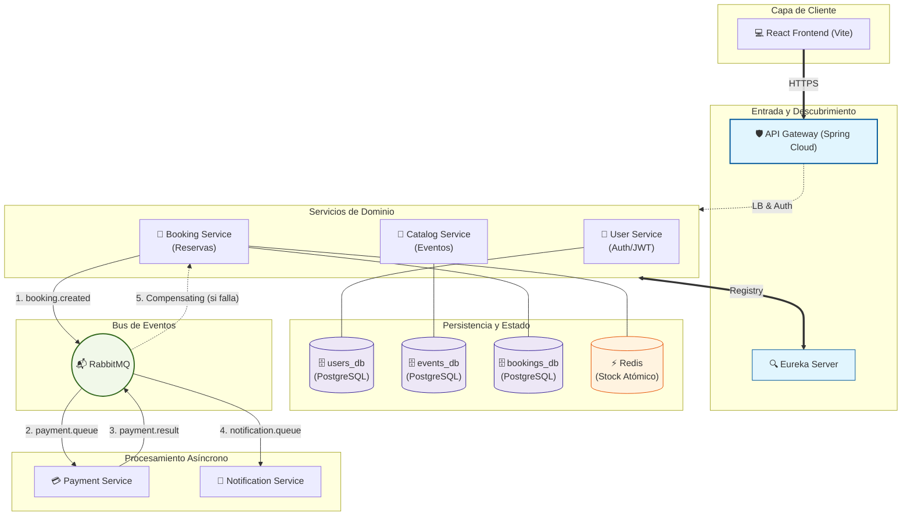

# 🎟️ Ticket System — Microservices Architecture

Sistema de venta de entradas a modo de practica sobre microservicios utilizando SpringBoot


---

## 🏗️ Arquitectura del Sistema

```
                        ┌─────────────────────────────┐
                        │   React Frontend (Vite)     │
                        │   http://localhost:5173     │
                        └─────────────┬───────────────┘
                                      │ HTTP
                        ┌─────────────▼───────────────┐
                        │    API Gateway  :8080       │
                        │  JWT Validation + Rate Limit│
                        └──┬──────┬───────┬───────────┘
                           │      │       │   (lb:// via Eureka)
              ┌────────────▼┐  ┌──▼────┐ ┌▼──────────┐
              │ User Service│  │Catalog│ │  Booking  │
              │     :8081   │  │:8083  │ │  :8082    │
              └─────┬───────┘  └──┬────┘ └─────┬─────┘
                    │              │             │
              ┌─────▼──┐     ┌─────▼─┐    ┌─────▼──────────────────┐
              │users_db│     │events │    │  bookings_db (Postgres)│
              │        │     │  _db  │    │  Redis (stock/locks)   │
              └────────┘     └───────┘    └──────────┬─────────────┘
                                                     │ RabbitMQ
                                    ┌────────────────▼──────────────┐
                                    │  payment-service (saga step)  │
                                    └────────────────┬──────────────┘
                                                     │ RabbitMQ
                                    ┌────────────────▼──────────────┐
                                    │  notification-service (email) │
                                    └───────────────────────────────┘
```

### Diagrama Mermaid



---

## 🛠️ Stack Tecnológico

| Capa | Tecnología |
|---|---|
| **Backend** | Java 21, Spring Boot 3.4, Maven |
| **Gateway** | Spring Cloud Gateway (WebFlux) |
| **Descubrimiento** | Spring Cloud Netflix Eureka |
| **Comunicación síncrona** | Spring Cloud OpenFeign |
| **Seguridad** | JWT (JJWT 0.11.5), stateless, centralizado en Gateway |
| **Bases de datos** | PostgreSQL 15 (una instancia por servicio) |
| **Migraciones** | Flyway |
| **Mensajería** | RabbitMQ (Saga Pattern) |
| **Cache / Stock** | Redis (operaciones atómicas DECR/INCR) |
| **Frontend** | React 19, TypeScript, Vite, TailwindCSS, TanStack Query |
| **Infraestructura** | Docker & Docker Compose |
| **Documentación API** | SpringDoc OpenAPI 3 (Swagger UI centralizado en Gateway) |

---

### Rutas públicas (sin token)
| Ruta | Método | Descripción |
|---|---|---|
| `/user/api/auth/login` | POST | Autenticación |
| `/user/api/auth/register` | POST | Registro |
| `/catalog/**` | GET | Listado de eventos (público) |

---

## 🚀 Guía de Inicio Rápido

### Requisitos
- Docker y Docker Compose
- Java 21 + Maven (solo para compilar sin Docker)

### Variables de Entorno requeridas
Crear un fichero `.env` en la raíz del proyecto (ver `docker-compose.yml`):

```env
JWT_SECRET=your-256-bit-secret-key-here
DB_USERNAME=admin
DB_PASSWORD=password
REDIS_PASSWORD=password
RABBIT_USER=guest
RABBIT_PASSWORD=guest
```

### Despliegue completo

```bash
# 1. Compilar todos los módulos
mvn clean package -DskipTests

# 2. Levantar infraestructura y servicios
docker compose up --build -d

# 3. Verificar que todo está UP
docker compose ps
```

### URLs de acceso

| Servicio | URL |
|---|---|
| **Frontend** | http://localhost:5173 |
| **API Gateway** | http://localhost:8080 |
| **Swagger UI** | http://localhost:8080/swagger-ui.html |
| **Eureka Dashboard** | http://localhost:8761 |
| **RabbitMQ Management** | http://localhost:15672 |

---

## 📁 Estructura del Proyecto

```
ticket-system-microservices/
├── frontend/                    # React + TypeScript (Vite)
├── services/
│   ├── gateway-service/         # API Gateway + JWT validation + Rate Limiting
│   ├── discovery-service/       # Eureka Server
│   ├── user-service/            # Auth (login/register) + User management
│   ├── catalog-service/         # Event catalog CRUD
│   ├── booking-service/         # Booking lifecycle + Redis stock control
│   ├── payment-service/         # Payment saga step (async, simulated)
│   └── notification-service/    # Email/notification saga step
├── docker-compose.yml
└── pom.xml                      # Parent POM (multi-module Maven)
```

---

## 📖 Documentación de API

Toda la documentación está centralizada en el Gateway mediante Swagger UI:

1. Iniciar el sistema completo con `docker compose up -d`
2. Abrir `http://localhost:8080/swagger-ui.html`
3. Seleccionar el servicio en el desplegable superior derecho

---

## 🔄 Patrón Saga (Flujo de Reserva)

```
Usuario → POST /booking/api/bookings
  │
  ├─ Valida evento (Feign → catalog-service)
  ├─ Valida usuario (Feign → user-service)  
  ├─ Descuenta stock en Redis (DECR atómico)
  ├─ Persiste booking con estado PENDING
  └─ Publica booking.created en RabbitMQ
         │
         ├─ payment-service consume → simula pago (80% éxito)
         │      ├─ Éxito → publica payment.success
         │      └─ Fallo → publica booking.failed
         │              │
         │              └─ booking-service consume → CANCELLED + INCR Redis
         │
         └─ notification-service consume payment.success → log ticket
```

---
