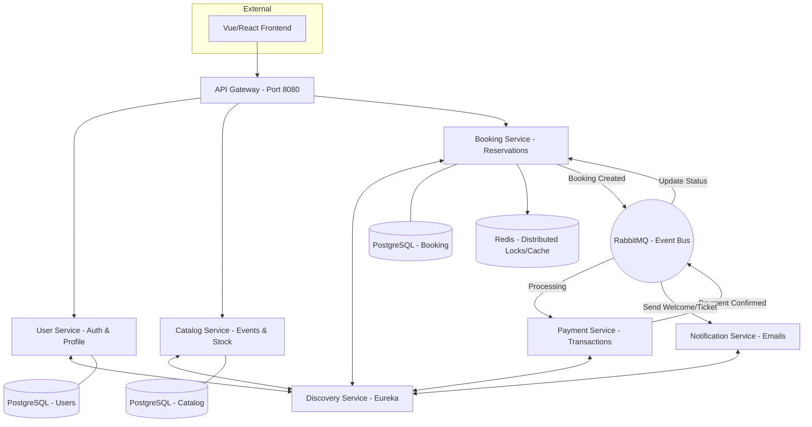

# 🎟️ Ticket System Microservices

Este proyecto es una arquitectura de microservicios robusta y escalable para la gestión de venta de entradas, diseñada bajo los principios de **Clean Architecture**, **Event-Driven Design** y **Cloud Native**.

## 🏗️ Arquitectura del Sistema

El sistema utiliza una arquitectura de microservicios donde cada servicio es responsable de una única capacidad de negocio y gestiona su propia base de datos.



## 🛠️ Stack Tecnológico

- **Backend:** Java 21, Spring Boot 3.4
- **Microservicios:** Spring Cloud (Gateway, Eureka, OpenFeign)
- **Seguridad:** JWT (JSON Web Token) con Stateless Authentication
- **Bases de Datos:** PostgreSQL (una instancia por servicio)
- **Mensajería:** RabbitMQ (Saga Pattern para transacciones distribuidas)
- **Rendimiento:** Redis (Control de concurrencia y stock en tiempo real)
- **Infraestructura:** Docker & Docker Compose
- **Migraciones:** Flyway

## 🚀 Guía de Inicio Rápido

### Requisitos
- Docker y Docker Compose
- Java 21 & Maven (para compilar)

### Instalación y Despliegue
1. **Compilar el proyecto:**
   ```bash
   mvn clean package -DskipTests
   ```
2. **Levantar la infraestructura:**
   ```bash
   docker-compose up --build -d
   ```
3. **Acceder a la documentación:**
   - **Gateway (Swagger):** `http://localhost:8080/swagger-ui.html`
   - **Eureka (Panel):** `http://localhost:8761`

## 📖 Documentación de API

Hemos centralizado toda la documentación en el **API Gateway**. Puedes consultar los contratos de todos los servicios desde una única interfaz:

1. Inicia el sistema completo.
2. Abre tu navegador en `http://localhost:8080/swagger-ui.html`.
3. Selecciona el servicio que deseas consultar en el desplegable superior derecho.

## 🔒 Seguridad e Integración

El sistema utiliza un flujo de seguridad basado en JWT. 
1. El **User Service** emite tokens tras el login/registro.
2. El **Gateway** aplica Rate Limiting para proteger el sistema.
3. El **Booking Service** valida la identidad del usuario contra su ID interno y la firma del JWT.

---
*Desarrollado como proyecto de portfolio para demostrar el manejo de arquitecturas distribuidas, consistencia eventual y alta disponibilidad.*
