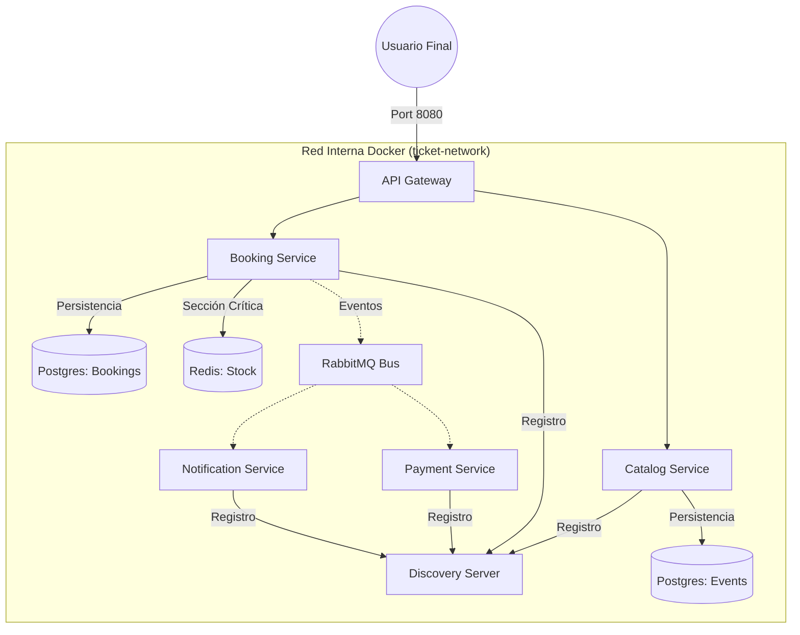
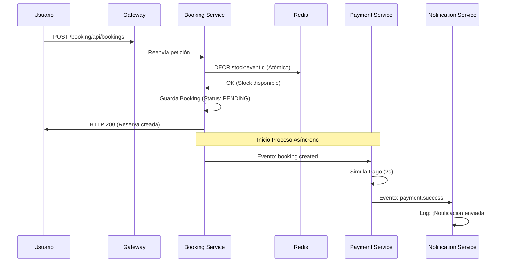
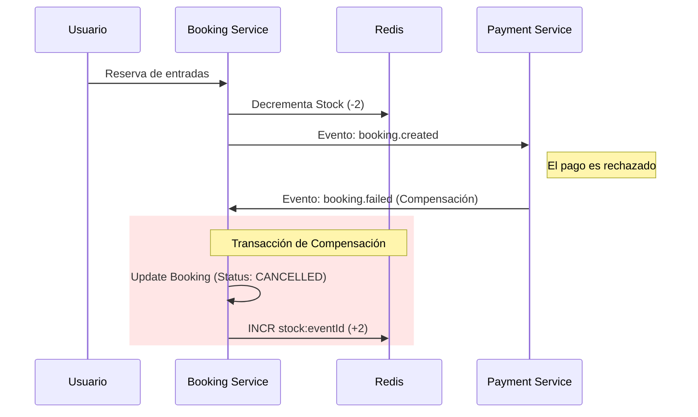
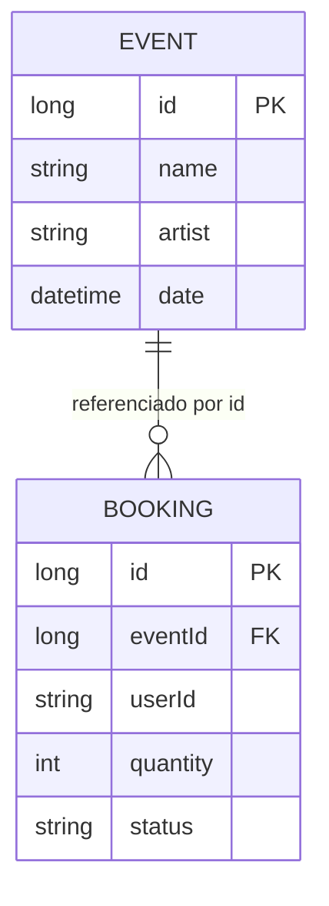

# 📊 Diagramas de la Arquitectura

Para entender visualmente cómo interactúan los componentes, hemos preparado estos diagramas utilizando **Mermaid**.

## 1. Mapa de Componentes (Infraestructura)
Este diagrama muestra cómo el **Gateway** protege los servicios internos y cómo todos dependen de **Eureka** para encontrarse.

---

## 2. Diagrama de Secuencia: Flujo Exitoso
Representa el camino "feliz" desde que el usuario solicita la entrada hasta que recibe la notificación.

---

## 3. Diagrama de Secuencia: Flujo de Compensación (Saga)
Muestra qué ocurre cuando el pago falla y el sistema debe auto-corregirse.

---

## 4. Estructura de Datos (ER Simple)
Cada servicio gestiona su propio esquema, pero están vinculados por IDs.

